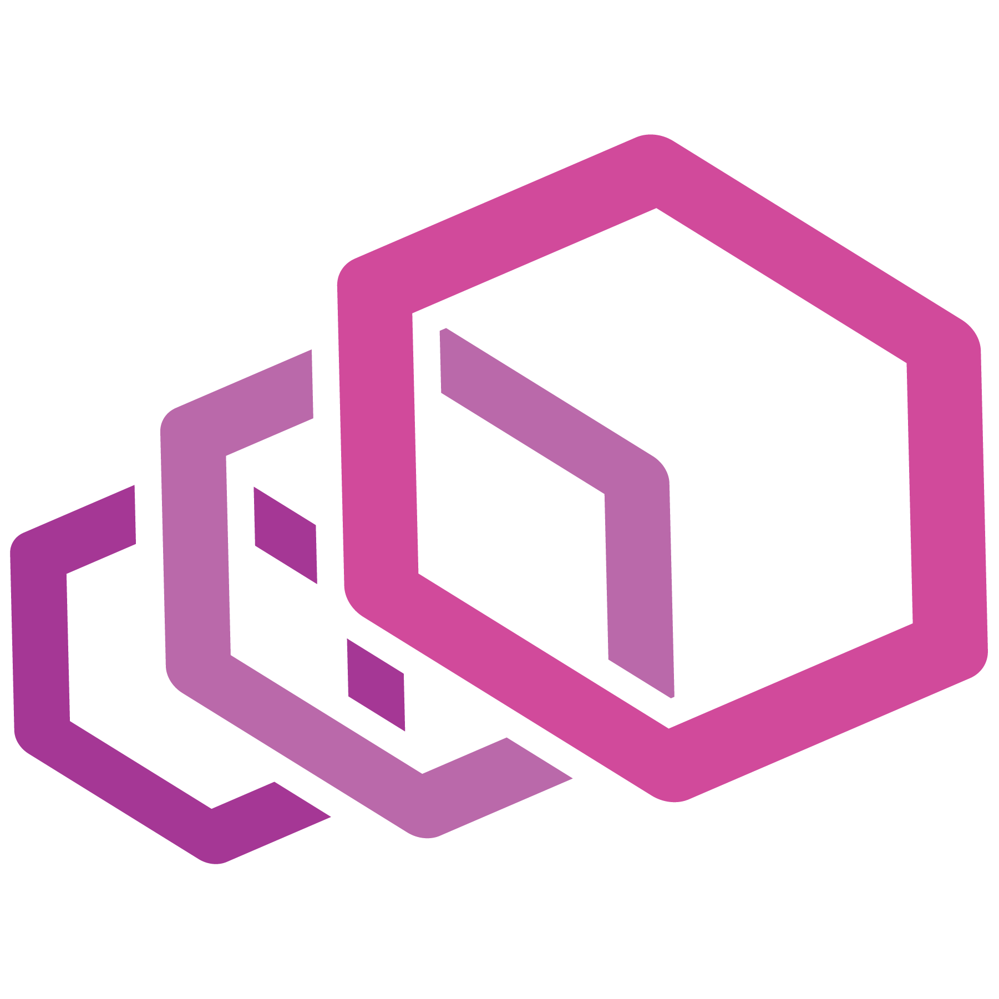

## Agenda

 
 
 

  

    <ul>
      <li><i>Lab 1</i>: Getting to know the Kubernetes Dashboard</li>
       
       
      <li><i>Lab 2</i>: Deploying the BookInfo application into Kubernetes</li>
       
       
      <li><i>Lab 3</i>: Checking the state of the BookInfo containers</li>
       
       
      <li><i>Lab 4</i>: Following the requests as they pass through the BookInfo containers</li>
       
       
      <li><i>Lab 5</i>: Deploying the BookInfo application using a package manager</li>
       
       
      <li><i>Lab 6</i>: Accessing BookInfo from the public internet</li>
       
       
      <li><i>Lab 7</i>: Clean Up</li>
    </ul>
  

  

    

      
      
      
    

    

      
      
    

  

 

---

## Contents

<!-- contents -->

